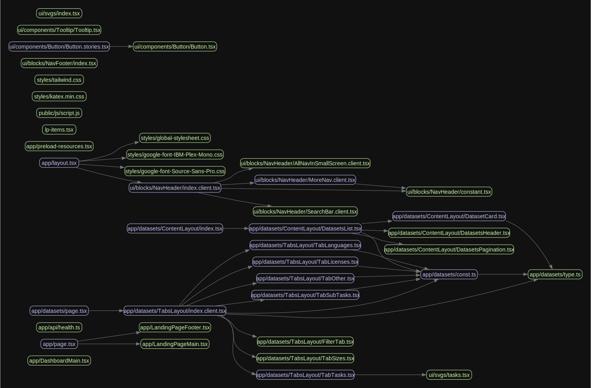

# Hugging Face Clone

> I initialed this project with the Next.js template [@Blazity/next-enterprise](https://github.com/Blazity/next-enterprise) on 2023-07-10. Look its README.md for more information about the technology behind this project.

## Why are we building this project

Hugging Face is now becoming the central community of AI. The website shows us a new way of sharing public datasets and apps (in iframe). And it also connects with [Gradio](https://www.gradio.app/) so profoundly that we can direct using Python to build web interfaces. Coupled with the help of the file-version-control-system, we can have a code-build-talk experience all in one place.

Considering I want to add the missing community to the spreadsheet databases ecology (or even to the iFrame ecology), Hugging Face (Which also has many great-looking Tailwind-CSS-based frontend pages) now seems the best application I can refer to. Let's first build this clone version project on a tremendous production-ready template [@Blazity/next-enterprise](https://github.com/Blazity/next-enterprise).

More motivations behind this project, I'll talk about it later (when a suitable version is ready).

## Architecture behind this repo

This graph is generated from [madege](https://github.com/pahen/madge) using `yarn coupling-graph`.

> A graph with circular dependencies. Blue has dependencies, green has no dependencies, and red has circular dependencies.

And this is not an all-included graph, for example, it can not show which is the Server Component, which is the Client Component, and what the tree . We want to add it as soon as possible (any suggestions are welcome.)

## 🤝 Contribution

Contributions are always welcome! To contribute, please follow these steps:

1. Fork the repository.
2. Create a new branch with a descriptive name.
3. Make your changes, and commit them using the [Conventional Commits](https://www.conventionalcommits.org/) format.
4. Push your changes to the forked repository.
5. Create a pull request, and we'll review your changes.

## 📜 License

This project is licensed under the MIT License. For more information, see the [LICENSE](./LICENSE) file.

## Contributors

We are waiting for your contribution!

<!-- ALL-CONTRIBUTORS-LIST:START - Do not remove or modify this section -->
<!-- prettier-ignore-start -->
<!-- markdownlint-disable -->
<!-- markdownlint-restore -->
<!-- prettier-ignore-end -->

<!-- ALL-CONTRIBUTORS-LIST:END -->
